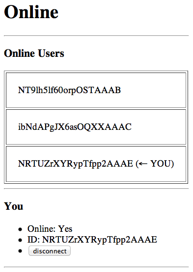

# Node Online Users

Node.js を使ってブラウザ上にオンラインのユーザー一覧を表示する例。内部的に WebSocket を活用している。

## スクリーンショット

## 使い方

- [npm](https://www.npmjs.org/) のインストール
- ライブラリのインストール↓

~~~
$ npm install socket.io node node-dev express
~~~

- サーバーの起動↓

~~~
$ sh run.sh
~~~

- ブラウザを何個か開いて [http://localhost:3030/](http://localhost:3030) にアクセス
- disconnectボタンを押したりリロードしたりして、「Online Users」や「Online」、「ID」が変わることを確認
- サーバー側のターミナルとブラウザ側でログ(chrome は ctrl+alt+i でデベロッパーツールが開く)にあれこれ表示されるのでそれも確認

## 対応バージョン

~~~
$ npm -v
1.4.23

$ node -v
v0.10.31
~~~

## 構造

### ファイル

~~~
$ tree
.
├── README.md
├── node-online-users.screenshot.png
├── public
│   ├── index.html
│   └── js
│       ├── jquery-1.11.1.js
│       └── online-users.js
├── run.sh
└── server.js

2 directories, 7 files
~~~

### ファイル詳細

- README.md : このファイル。説明やインストール方法など
- node-online-users.screenshot.png : スクリーンショット
- run.sh : サーバーを起動させるためのスクリプト
- server.js : サーバーサイドのコード
- public : ディレクトリ
    - index.html : 表示される HTML
    - js
        - jquery-1.11.1.js : 現時点での最新のjQuery
        - online-users.js : クライアント(ブラウザ側)で走るコード

## 展望

- Redis あたりにオンラインユーザー一覧を格納して、nodeサーバーのスケールアウトに対応させるのも面白いかも